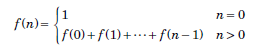
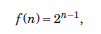
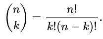

# Permutations & Combinations

## Combinatorics

Methods for counting combinations of objects.

---

### Example

**Problem:** Count the number of ways to represent an integer \( n \) as the sum of positive integers.

For \( n = 4 \), there are 8 ways:

1. \( 1 + 1 + 1 + 1 \)
2. \( 2 + 2 \)
3. \( 1 + 1 + 2 \)
4. \( 1 + 2 + 1 \)
5. \( 2 + 1 + 1 \)
6. \( 3 + 1 \)
7. \( 1 + 3 \)
8. \( 4 \)

---

### Solutions

1. **Recursive Solution:**
    - Formula: \( f(n) = f(0) + f(1) + ... + f(n-1) \), where \( n > 0 \)
    
  
2. **Closed Form Solution:**
    - Formula: \( f(n) = 2^{n-1} \)
    

---

### Key Points
- **Recursive Functions:** Can be used to solve combinatorial problems.
- **Closed Form Formulas:** Provide a quicker way to find solutions in some cases.

---
## Binomial Coefficients

The binomial coefficient equals the number of ways we can choose a subset of k elements from a  set of n elements. 

-The set:

{1,2,3,4,5} has 10 subsets of 3 elements:

{1,2,3},{1,2,4},{1,2,5},{1,3,4},{1,3,5},{1,4,5},{2,3,4},{2,3,5},{2,4,5},{3,4,5}.

---

# Some topics to solve math related combinatorics problem:

## Factorial:

 In factorial we need to know :

---

## nCr, nPr:

 By nCr we mean:

nCr formula is used to find the number of ways of choosing r objects from n objects where the order is not important.

**Example:**
 So if we have a string abcde and we have to choose 2 chars from them like : ab ac ad ae bc ....

 Q -> In how many ways we can do that ?
 
 A -> It is 5C2. means we can calculate like this:

   5!
________
2!(5-2)!

**Formula for nCr :**

---

## Inverse Factorial

---

## Modular Operations:

--- 