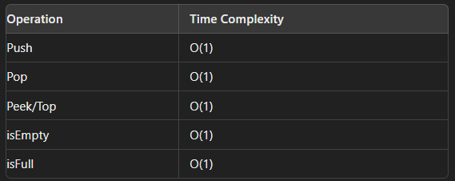

# Stack Implementation in C

## Introduction to Stack

A **stack** is a linear data structure that follows the Last In, First Out (LIFO) principle. This means that the last element added to the stack will be the first one to be removed. Think of it like a stack of plates; you can only take the top plate off first.

### Key Operations:

- **Push**: Add an element to the top of the stack.
- **Pop**: Remove the top element from the stack.
- **Peek/Top**: Retrieve the top element without removing it.
- **isEmpty**: Check if the stack is empty.
- **isFull**: Check if the stack is full.

---

## Stack Implementation in C

### Structure Definition

We define a `stack` structure to hold the stack properties:

**Initialization of Stack: **

```c
stack* createStack(int size) {
    stack *s = (stack*) malloc(sizeof(stack));
    s->size = size;
    s->top = -1;
    s->arr = (int*) malloc(s->size * sizeof(int));
    return s;
}
```

---

**Push Operation implementation:**

```c
void push(stack *ptr, int val)
{
    if(isFull(ptr))
    {
        printf("Cannot push . stack full \n");
    }
    // coz there is no empty space and top reached arr size - 1.

    else
    {
        ptr->top++;
        ptr->arr[ptr->top] = val;
    }
}
```

---

**Pop Operation imeplementaion:**

```c
int pop(stack * ptr)
{
    if(ptr->top == -1)
    {
        printf("Cannot pop, stack is empty \n");
    }
    // coz top is -1, which is actually pointing towards nothing.
    // because there is no value stored

    else
    {
        ptr->top = ptr->top - 1;
    }
}
```

---

**Peek/Top Operation Implementation:**

```c
int peek(stack* s) {
    if (s->top == -1) {
        printf("Stack is empty\n");
        return -1;
    }
    return s->arr[s->top];
}
```

---

**isEmpty Operation Implementation:**

```c
int isEmpty(stack *top)
{
    if (top == NULL)
    {
        return 1;
    }

    else
    {
        return 0;
    }
}
```

---

**isFull Operation Implementation:**

```c
int isFull(stack *top)
{
    stack *p = (stack *)malloc(sizeof(stack));

    if (p == NULL)
    {
        return 1;
    }

    else
    {
        return 0;
    }
}
```

## Time Complexity :



