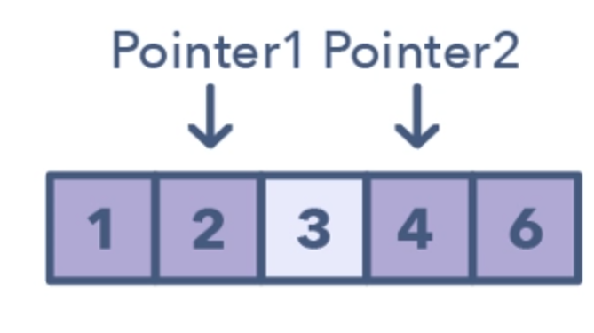

# Two Pointer Technique Documentation

## What is Two Pointer Technique?

Two pointer technique is normally used for searching and it employs two pointers in one loop over the given data structure. This technique is mostly related to strings, arrays, and linked lists.



## Why Do We Use It?

To use two pointers, the data structure often needs to be ordered in some way, which helps reduce the complexity from \(O(n^2)\) or \(O(n^3)\) to \(O(n)\) by having just one loop with two pointers and searching each item just once.

Depending on whether the input string/array is sorted or not, the two-pointer method can have a time complexity of \(O(n \log n)\) or even better, which is \(O(n)\) if the data is sorted.

## Variants of Two Pointer

There are two ways to solve two-pointer problems:

### First Approach: Opposite Direction

One pointer starts from the beginning while the other pointer starts from the end. They move toward each other until they both meet or some condition is satisfied.

### Second Approach: Equi-Direction

Both pointers start from the beginning, with one being a slow runner and the other a fast runner.

## Coding Example

Here is an example in C++ demonstrating the two-pointer technique to find if there are two numbers in a sorted array that add up to a given target:

```cpp
#include <iostream>
#include <vector>

using namespace std;

bool hasTwoSum(const vector<int>& nums, int target) {
    int left = 0;
    int right = nums.size() - 1;

    while (left < right) {
        int sum = nums[left] + nums[right];
        if (sum == target) {
            return true;
        } else if (sum < target) {
            left++;
        } else {
            right--;
        }
    }

    return false;
}

int main() {
    vector<int> nums = {1, 2, 3, 4, 6};
    int target = 8;

    if (hasTwoSum(nums, target)) {
        cout << "Array has two elements with sum " << target << endl;
    } else {
        cout << "No two elements with sum " << target << endl;
    }

    return 0;
}
```

