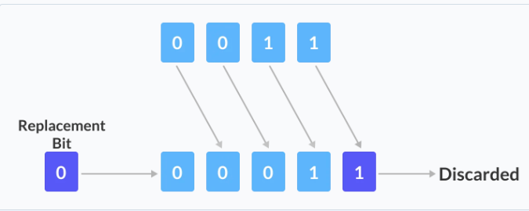
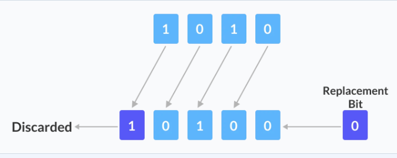

# Bitwise Operator

## 1. Bitwise AND operator:

The bitwise AND **&** operator returns 1(true) if and only if both operands are 1. otherwise returns 0(false).

### Code example of bitwise and:

```cpp
#include <iostream>
using namespace std;

int main() {
    // declare variables
    int a = 12, b = 25;

    cout << "a = " << a << endl;
    cout << "b = " << b << endl;
    cout << "a & b = " << (a & b) << endl;

    return 0;
}
```

we are performing bitwise AND between variables a and b.

## 2. Bitwise OR operator:

The bitwise OR **|** operator returns 1(true) if at least one of the operands is 1. Otherwise, it returns 0(false).

### Code example of bitwise or operator:

```cpp
#include <iostream>

int main() {
    int a = 12, b = 25;

    cout << "a = " << a << endl;
    cout << "b = " << b << endl;
    cout << "a | b = " << (a | b) << endl;

    return 0;
}
```

## 3. Bitwise XOR operator:

The bitwise XOR **^** operator returns 1(true) if and only if one of the operands is 1. However, if both the operands are 0, or if both are 1, then the result is 0(false).

Image example of XOR operator:


### Code example of bitwise XOR operator:

```cpp
#include <iostream>

int main() {
    int a = 12, b = 25;

    cout << "a = " << a << endl;
    cout << "b = " << b << endl;
    cout << "a ^ b = " << (a ^ b) << endl;

    return 0;
}
```

## 4. Bitwise Complement operator:

The bitwise complement operator is a unary operator (**works on only one operand**). It is denoted by **~** that changes binary digits 1 to 0 and 0 to 1.

## 5. 2's Complement:

The 2's complement of a number N gives -N.

In binary arithmetic, 1's complement changes 0 to 1 and 1 to 0.

And, if we add 1 to the result of the 1's complement, we get the 2's complement of the original number.

### Code example of Bitwise complement:

```cpp
#include <iostream>

int main() {
    int num1 = 35;
    int num2 = -150;
    cout << "~(" << num1 << ") = " << (~num1) << endl;
    cout << "~(" << num2 << ") = " << (~num2) << endl;

    return 0;
}
```

## Shift Operators:

There are two shift operators in C++ programming:

* Right shift operator **>>**
* Left shift operator **<<**

## 6. Right shift operator:

The right shift operator shifts all bits towards the right by a certain number of specified bits. It is denoted by **>>**.

When we shift any number to the right, the least significant bits are discarded, while the most significant bits are replaced by zeroes.



When we perform a one-bit right shift operation on it, each individual bit is **shifted to the right by 1 bit**.

## 7. Left shift operator:

The left shift operator shifts all bits towards the left by a certain number of specified bits. It is denoted by **<<**.



When we perform a 1 bit left shift operation on it, each individual bit is shifted to the left by 1 bit.

### Code example of shift operators:

```cpp
#include <iostream>

int main() {

    // declaring two integer variables
    int num = 212, i;

    // Shift Right Operation
    cout << "Shift Right:" << endl;

    // Using for loop for shifting num right from 0 bit to 3 bits 
    for (i = 0; i < 4; i++) {
        cout << "212 >> " << i << " = " << (212 >> i) << endl;
    }

    // Shift Left Operation
    cout << "\nShift Left:" << endl;

    // Using for loop for shifting num left from 0 bit to 3 bits
    for (i = 0; i < 4; i++) {
        cout << "212 << " << i << " = " << (212 << i) << endl;
    }

    return 0;
}
```